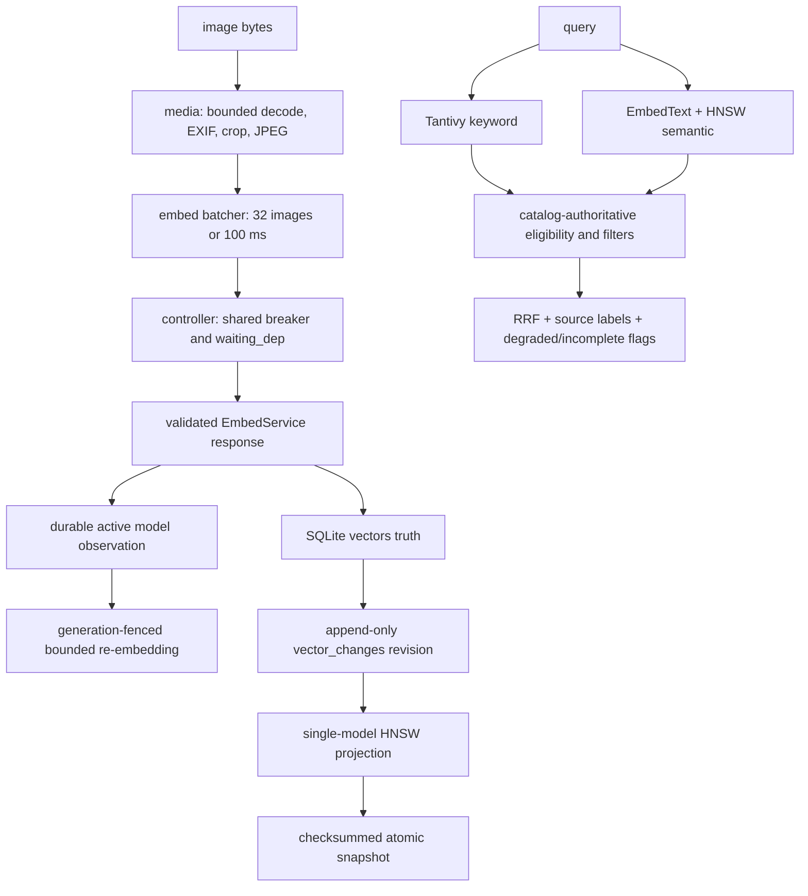

# Index-node M5 开发故障复盘

本文沿用 `docs/m3-development-bug-log.md` 的证据优先结构，记录 M5 图片语义阶段从实现、终审到门禁收敛过程中实际出现的问题。它不是功能宣传稿，也不把测试环境噪声伪装成产品缺陷；每一项都尽量给出发现方式、最小复现、根因、最终修复和回归测试。

## 1. 完成基线

M5 的交付范围是：静态图片预处理、compute gRPC 客户端、按任务保持原子性的微批、共享熔断与 `waiting_dep`、SQLite 向量事实、HNSW 投影与快照恢复、semantic/hybrid 查询、RRF，以及 Bubble Tea stopped-node `/search`。

最终门禁全部以实际命令结果记录，未以局部测试代替全量结论：

- `go test -buildvcs=false -count=1 ./...`：通过，覆盖当前 23 个 Go package；其中包含 1000 文件幂等主干、crash re-exec、真实 Tantivy、M5 mock-gRPC acceptance 和所有新增模型迁移回归。
- `go test -buildvcs=false -race -count=1 ./...`：通过，无 data race。
- `go vet -buildvcs=false ./...`：通过。
- `go build -buildvcs=false ./cmd/indexnode`：通过。
- 强制覆盖率：`internal/store 80.3%`、`internal/debounce 90.6%`、`internal/errclass 97.2%`、`internal/scheduler 90.8%`，均达到任务书的 80% 门槛。
- `go mod tidy -diff`：空输出；依赖图无漂移。
- checked-in protobuf 在相同 proto 上重新生成后 SHA-256 不变。
- 当前所有 53 个 M5 改动/新增 Go 文件通过 `gofmt -l`，`git diff --check` 无 whitespace error。
- 全量普通与 race 最终均在 unsandboxed Windows 系统 TEMP 下执行；workspace TEMP 的 Tantivy `AccessDenied` 只作为 E-03 诊断证据，不计为产品失败，也没有通过放宽断言规避。
- 最终 P0/P1 只读复审结论为 clean：dispatch epoch、模型维度契约、旧响应隔离、re-embedding 边界和错误分级均未发现新的阻断项。

确定性验收入口为：

- `internal/index/m5_acceptance_test.go::TestM5AcceptanceDeterministicSemanticDegradeAndRestart`
- 真实 `bufconn` gRPC `EmbedService`，不是绕过 wire contract 的函数假对象；
- 红、蓝两张图片经过真实 `media -> embed client/batcher/controller -> vectors/HNSW -> search` 路径；
- query `red` 首位命中红图；
- compute 停止后 hybrid 保留 keyword 命中并显式标记 `degraded_semantic=true`；
- 组件停止并重新打开向量索引后，从 snapshot 加载，结果顺序与停止前一致。

## 2. 最终数据、版本与并发模型

M5 最容易出错的地方不是“能不能算出一条向量”，而是五个异步状态面是否最终收敛：远端模型、catalog、SQLite 向量事实、HNSW 投影和查询结果。



### 2.1 五种版本字段不能互相替代

1. `meta.active_embed_model_version`
   - 含义：本节点最近一次从完整、合法的 compute 响应中确认的目标模型。
   - 它是升级目标，不代表所有文件已经迁移完成。
   - `embed_model_contracts` 同时保存该 version 不可变的 dims；二者共同定义模型空间。

2. `files.embed_model_version`
   - 含义：该文件当前成功提交的图片向量实际属于哪个模型。
   - 文件重嵌入成功前必须保留旧值。

3. `vectors.model_version`
   - 含义：每条 SQLite 向量事实的模型来源。
   - 这是 HNSW 重建的输入，不允许用启动配置覆盖响应值。

4. HNSW `modelVersion + dims + revision`
   - 含义：一个模型空间下，投影已经确认到哪个 durable change revision。
   - revision 不能脱离模型单独推进。

5. `dead_letters.embed_model_version`
   - 含义：失败真正发生时 worker 观察到的运行时模型。
   - reliability 用它判断模型升级后是否应自动 redrive。

对应实现边界：

- `internal/pipeline/embed/batcher.go::observeModel`
- `internal/reliability/manager.go::ObserveEmbedModel`
- `internal/store/model_upgrade.go`
- `internal/store/vectors.go::ReplaceVectorsForFileAndVersion`
- `internal/index/vector.go`
- `internal/pipeline/worker/processor.go::currentEmbedModelVersion`

### 2.2 写入顺序

图片成功路径固定为：

1. IO stage 打开并稳定读取文件；
2. media 在像素数和 decoded-byte 预算内完成归一化；
3. IO reader 关闭，避免等待远端 RPC 时长期占用文件句柄；
4. batcher 以“任务不可拆分”为边界组批；
5. client 校验 cardinality、dims、`model_version`、有限值和非零 L2 norm；
6. `OnModel` 先把实际模型握手持久化；
7. SQLite 替换该文件向量事实并产生 change revisions；
8. 单写者把同一变更投影到 HNSW；
9. Tantivy/file catalog 提交完成后任务才进入 `done`。

删除或图片改成文本时，顺序反过来的风险更高：必须先 generation-fenced 删除向量，再提交 Tantivy，不能留下可被 semantic 召回的旧图片向量。

### 2.3 查询和降级矩阵

| 模式 | Compute/HNSW | `failed` 文件 | Compute 不可用或模型迁移 | 本地 ANN/SQLite 错误 |
|---|---|---|---|---|
| keyword | 不初始化 | filename/path 可搜；旧正文不返回 | 不受影响 | 返回错误 |
| semantic | 必需 | 不进入结果 | 空 semantic 结果并标记 degraded | 返回错误 |
| hybrid | keyword 与 semantic 并发 | 仅可走 keyword 路由 | 保留 keyword 并标记 degraded | 返回错误 |

catalog filter 位于后端候选获取之后，因此查询会从 `topK*4` 起几何扩大候选窗口，最大 1000。达到 hard cap 仍不足时返回已有结果并设置 `SearchResponse.Incomplete=true`，而不是把“候选被截断”伪装成完整空结果。

RRF 使用过滤后每一路的有效排名：

```text
score(file) = sum(1 / (60 + rank_in_route))
```

同一文件多帧只保留语义分数最高帧的 `frame_ts_ms`，命中来源按 `content`、`note`、`semantic` 去重显示。M5 的 note 路由结构已保留，但实际 note 数据属于 M7。

## 3. 主事故：运行时模型升级形成 v1/v2 分裂

### 3.1 如何发现

初版确定性 acceptance 覆盖了固定模型、compute 下线和进程重启，却没有覆盖“节点不重启，compute 从 v1 切换到 v2”。最终 P1 审计沿着 model provenance 检查 lifecycle、batcher、reliability、worker、vectors 和 HNSW，发现启动时读取的模型值被错误地当成进程全生命周期常量。

这不是一个单点字段错误，而是会形成连续故障：

1. `EmbedText` 已拿到 v2 query vector；
2. HNSW 仍是 v1，正确实现应拒绝跨空间检索；
3. 第一张新图片写入 v2 后，单模型 HNSW 切到 v2；
4. 旧图片没有 durable 重嵌入任务，因此从 v2 semantic 结果中长期消失；
5. reliability 仍以启动时 v1 判断版本死信，不能正确 redrive；
6. worker 新产生的死信也可能错误记录为 v1。

### 3.2 最小复现

1. 用 `model-v1` 索引至少两张图片，并留下一个记录 v1 的 embed dead letter；
2. 保持 index-node 进程运行，把 mock compute 响应切换为合法 `model-v2`；
3. 发起 semantic/hybrid query，使 `EmbedText` 观察到 v2；
4. 检查 `meta.active_embed_model_version`、catalog generation、pending task、dead-letter redrive 和 HNSW model；
5. 继续处理一批迁移任务，验证旧图片逐步进入 v2，而不是永久丢失；
6. 期间 hybrid keyword 必须仍能搜到尚未重嵌入的图片文件名。

### 3.3 根因

- 把“启动时模型”当成动态依赖的长期状态；
- 没有区分 compute 当前模型、文件已提交模型和 HNSW 当前投影模型；
- 模型切换只在 vector writer 局部重建 graph，没有升级成 catalog 范围的 durable migration；
- acceptance 只覆盖 restart，没有覆盖依赖在运行中变更版本。

### 3.4 失败的中间方案

#### 方案 A：首个 v2 vector write 顺手更新全局 active model

问题：已有 v1 RPC 可能仍在 flight。它稍晚提交时会把 active model 从 v2 反向覆盖回 v1。文件向量写入和进程目标版本不是同一状态，不能共用一条“最后写者获胜”的 meta 更新。

#### 方案 B：把 v1/v2 节点混入同一 HNSW

问题：不同模型的坐标空间没有可比较语义，即使 dims 相同，内积也没有意义。这会产生看似有分数、实际不可解释的静默错误。

#### 方案 C：在 query 线程一次性重排所有旧图片

问题：目录规模无界、阻塞交互查询、不耐崩溃，也绕开了现有 scheduler、generation fence 和重试状态机。

#### 方案 D：模型不匹配和所有 ANN 错误统一 degraded

问题：会掩盖 snapshot 损坏、SQLite 错误、维度错误或本地 HNSW bug。只有 compute 可用性错误和明确的模型迁移 mismatch 可以降级。

#### 方案 E：重嵌入入队时立即把文件改成 pending

问题：模型迁移只是投影更新，文件字节和旧关键词文档仍然有效。如果批量排队期间直接把 catalog 状态改成 pending，hybrid 会丢掉本应保留的 filename/path fallback。

### 3.5 最终修复

1. `Client` 完成 response 全量校验后，`Batcher` 才调用 `OnModel`。
2. `OnModel` 持久化失败时，本批 embeddings 不向 worker/query 暴露；但这类本地应用错误不计为 compute 健康失败。
3. `reliability.Manager.ObserveEmbedModel` 先写 `active_embed_model_version`，再同步 generation-fence 首个有界批次。
4. reliability 后台每次只继续一个有界批次，并唤醒 scheduler，迁移可崩溃恢复且不会一次性占满队列。
5. 入队时保留 `status=indexed`，仅清空 `indexed_at` 并 `generation+1`；任务真正 Prepare 时才进入 pending。
6. `worker.Config.CurrentEmbedModelVersion` 改为并发安全 accessor，死信记录运行时版本。
7. `ReplaceVectorsForFileAndVersion` 只保存文件/向量事实，不再修改进程 active model，避免旧 in-flight 写回滚目标版本。
8. stopped-node `/search` 也在合法 query response 后持久化新模型并启动首批 durable migration。
9. HNSW 始终只包含一个模型空间；v2 query 对 v1 graph 的 mismatch 显式降级，随后随着 durable re-embedding 收敛。

### 3.6 回归测试

- `internal/pipeline/embed/batcher_test.go::TestBatcherObservesOnlyValidatedModelsAndPropagatesAdoptionFailure`
- `internal/store/model_upgrade_test.go::TestEmbedModelUpgradeAdoptionAndBoundedDurableRequeue`
- `internal/reliability/manager_test.go::TestObserveEmbedModelDurablyStartsOneUpgradeAndDeduplicatesResponses`
- `internal/reliability/manager_test.go::TestRuntimeModelChangeRedrivesDeadLetterAndProgressivelyRequeuesImages`
- `internal/pipeline/worker/processor_test.go` 的运行时模型 dead-letter provenance 回归
- `internal/maintenance/service_test.go::TestStoppedSearchObservesNewModelAndDurablyStartsReembedding`

## 4. 最终审计发现的七个 P1

### B-01：failed 文件被统一 catalog filter 隐藏

#### 发现与复现

M4 已保证失败文件在 Tantivy 中保留 filename/path 最小文档。M5 初版 SearchService 却把所有路由统一限制为 `status=indexed`，导致 Tantivy 已命中、最终结果仍被 catalog 层丢弃。

#### 根因

keyword 和 semantic 错误复用了同一个 eligibility 判断。两条路由的安全契约不同：keyword 可以返回失败文件的标识信息，semantic 不能返回旧向量。

#### 修复

- keyword 接受 `indexed` 和 `failed`；
- failed 命中清空 snippet，只保留 filename/path，不泄露上一成功 generation 的正文；
- failed 文件禁止进入 semantic/frame route；
- semantic 仍要求 `indexed`、generation 一致且模型一致。

#### 回归

`internal/index/search_test.go::TestSearchFailedCatalogFileKeepsFilenameRouteWithoutStaleContentOrSemantic`

### B-02：固定 `topK*4` 后置过滤导致第 81 名假空

#### 发现与复现

默认 `topK=20` 时初版只向后端取 80 条，再做 path/kind/mtime catalog filter。把唯一满足过滤器的文档放到第 81 名，响应错误地为空。

#### 根因

过滤必须由 SQLite catalog 权威执行，但 Tantivy/HNSW 接口只有 top-N，没有 offset。固定 multiplier 不能保证过滤后的 top-K 完整。

#### 修复

候选窗口按 `80 -> 160 -> 320 -> 640 -> 1000` 几何扩大。只有后端填满当前窗口且有效命中不足时继续；query embedding 在扩窗之间复用，不重复调用 compute。达到 1000 仍不足时设置 `Incomplete`。

#### 回归

- `TestSearchExpandsPastInitialWindowForFilteredRankEightyOne`
- `TestSearchMarksFilteredResponseIncompleteAtCandidateHardLimit`
- `internal/cli/maintenance_test.go::TestMaintenanceResultFormatting`

### B-03：lifecycle/reliability/worker 冻结启动模型

这是主事故的运行时状态部分。最终通过 `CurrentEmbedModelVersion()`、`ObserveEmbedModel()`、Batcher `OnModel` 和 worker accessor 修复，并用 runtime v1 -> v2 dead-letter redrive 测试覆盖。

### B-04：compute 升级没有旧图片的 durable 重嵌入

这是主事故的 catalog migration 部分。修复由 `internal/store/model_upgrade.go` 提供：有界选择旧模型的 indexed image，保持 keyword 可用，清空 unchanged marker，generation+1 并原子入队；reliability 继续剩余批次。

### B-05：运行时 delta gap 用空模型重建，却确认了新 revision

#### 发现与复现

1. catalog 中仍有较早的 v1 图片；
2. 当前请求已把某文件 vectors truth 替换成 v2；
3. 人为制造 `vector_changes` revision 缺口；
4. replay 失败后旧代码调用 `rebuildFromStore(ctx, "")`；
5. heuristic 可能因 catalog 排序选择 v1 graph；
6. 代码随后却把 revision 推进到已经包含 v2 change 的 durable watermark。

结果是 `catalog/vectors` 已有 v2、ANN 仍为 v1，而该 v2 revision 已被错误确认，不会再次重放。

#### 根因

把 revision 当作独立标量，没有与 model space 绑定；runtime writer 明明知道 `request.model`，却退回启动期 heuristic。

#### 修复

`applyRequest` 在 `vectorReplace` replay 失败时，必须用精确的 `request.model` 全量重建。只有启动时没有请求上下文，或 delete 后图为空时，才允许从 durable catalog 推断目标模型。安装 graph 与推进 revision 是同一次状态替换。

#### 回归

`internal/index/vector_test.go::TestVectorIndexRuntimeGapRebuildUsesRequestModel`

### B-06：同一 `model_version` 的跨响应维度漂移先污染 truth

#### 发现与复现

1. 已有 `model-v1/dims=2` 文件和可正常打开的 HNSW；
2. compute 对另一请求返回内部完全合法、但声明仍为 `model-v1/dims=3` 的响应；
3. 初版 client 只能证明“本次响应自洽”；
4. vector writer 先把 dims=3 行写入 SQLite，再在 HNSW replay 时发现同模型维度不一致；
5. SQLite 已成为 dims=2/dims=3 混合 truth，重启全量 rebuild 仍失败。

#### 根因

`model_version` 和 `dims` 实际是一个不可拆分的模型空间标识，但初版 active handshake 只持久化版本；`ReplaceVectorsForFileAndVersion` 也只校验本批内部维度一致，没有在 transaction commit 前核对该模型的 durable 维度契约。

#### 修复

- 经过验证的模型观察同时携带 version 和 dims；
- durable store 为每个 model version 建立不可变 dims contract；
- 旧库首次建立 contract 时先核对该模型已有 vector rows，不能给已经混合的 truth 补一个虚假 meta；
- 所有 vector put/replace 路径在删除旧 rows、写新 rows之前，于同一 transaction 内校验或建立 contract；
- 维度漂移作为本地/响应契约错误返回，不打开 compute breaker；失败 transaction 不产生 vector change revision，也不污染 files model marker。

#### 回归

`internal/index/vector_test.go::TestVectorModelDimensionsAreDurableAndRejectDriftBeforeTruthMutation` 断言：第二次写入失败、原文件向量不变、最大 revision 不推进、拒绝项不可见、关闭并重开 `OpenVectorIndex` 后仍可搜索。

### B-07：迟到的旧模型响应回滚已采用的新模型

#### 发现与复现

默认允许 8 个 RPC 并发，因此响应顺序不等于 dispatch 顺序：

1. epoch 1 的 v1 RPC 先发出并变慢；
2. compute 切到 v2；
3. epoch 2 请求先返回 v2，active model 已持久化为 v2；
4. epoch 1 随后返回合法 v1；
5. 初版 `ObserveEmbedModel` 看到“不同于当前模型”就采用，因而把 active meta、重嵌入方向和 HNSW 再次翻回 v1。

#### 根因

只比较版本相等性，没有记录响应所对应的请求顺序。单纯禁止 model rollback 也不正确，因为更晚 dispatch 的正式回滚必须被允许。

#### 修复

- 在 RPC 真正 dispatch 时分配进程内单调 epoch，image batch 与 text query 共用同一序列；
- model observation 携带 `(epoch, version, dims)`；
- durable adoption 成功后才推进 last-adopted epoch；
- 早于已采用 epoch 的同模型响应允许继续使用；
- 早于已采用 epoch 的异模型响应被识别为 stale transition，不得写 active meta、不得启动反向迁移、不得持久化其向量；
- 更新 epoch 的异模型响应仍可表达一次正式 rollback；
- stale transition 证明 compute 可达，不计入 breaker 健康失败。

#### 回归

- `internal/pipeline/embed/batcher_test.go::TestBatcherDispatchEpochRejectsLateDifferentModelButAllowsRollbackAndSameModel`
- `internal/pipeline/embed/batcher_test.go::TestBatcherFailedAdoptionDoesNotAdvanceDispatchEpoch`

这两项用受控 RPC 顺序覆盖“慢 v1 / 快 v2 / 迟到 v1 被拒绝”“迟到同模型允许”“更新 epoch 正式 rollback 允许”和“durable adoption 失败不能推进 epoch”，并确认 stale 响应不会打开 breaker。

## 5. 其他产品与集成故障

### B-08：仅扫描当前 vectors 无法恢复快照后的删除

#### 问题

`vectors` 当前表只保留现状。snapshot 之后发生 delete 或 replace 时，单纯“Import snapshot，再扫描当前 rows 补齐”只能知道应新增什么，无法知道旧 snapshot 节点应删除什么，可能复活已删除向量。

#### 修复

- migration `0005_vector_changes.sql` 用 trigger 为 insert/update/delete 写 append-only revision；
- snapshot header 保存 durable revision；
- Import 后只接受严格连续的 suffix；
- gap、checksum 错、model/dims/config 不兼容均全量重建；
- snapshot 临时文件 sync 并原子替换成功后，才允许 prune 已覆盖 change rows；
- SQLite autoincrement 水位保留，不能因 prune 回退。

#### 回归

- `TestVectorIndexSnapshotDeltaDeleteAndCorruptionRecovery`
- `internal/store/vectors_test.go::TestVectorChangesAndGenerationFencedDelete`
- ADR：`docs/adr/0006-hnsw-snapshots-and-vector-change-log.md`

### B-09：图片删除或改成文本后保留旧向量

#### 根因

如果先提交 Tantivy/catalog，再异步删除 vector，查询会短暂或永久召回已经不存在的图片语义。

#### 修复与回归

remove 和 text overwrite 都先走 generation-fenced vector delete，再提交 Tantivy：

- `TestM5RemoveDeletesVectorsBeforeTantivy`
- `TestM5TextOverwriteDeletesOldImageVectorsBeforeTantivy`

### B-10：一个失败 RPC 覆盖多个任务，但 waiting_dep 不是批次原子语义

#### 问题

微批可能同时包含多个 durable task。逐 task 获取 breaker permit 或逐行停泊会产生部分成功、部分 retry、attempts 不一致，无法描述“一次 RPC 全部失败”。

#### 修复

- `AcquireBatch` / `BatchCall` 对一个 RPC 只消费一个 breaker permit；
- `MarkWaitingDepBatch` 在一个 SQLite transaction 内停泊全部 task；
- refund 本次 Claim attempt；
- half-open 成功后批量 release 并唤醒 scheduler。

#### 回归

- `TestControllerBatchFailureUsesOnePermitAndParksAtomically`
- `TestBatcherFailureParksEntireRPCBatchWithZeroAttempts`
- `internal/store/taskqueue_states_test.go` 批量 waiting_dep 回归

### B-11：controller 已停泊后 worker 再做一次失败转换

#### 问题

`ErrWaitingDependency` 表示任务状态已经由 controller 持久化。如果 worker 把它当普通 embed error 再 `MarkRetry`/`MarkDead`，会破坏零 attempts 增长和 batch 原子性。

#### 修复与回归

worker 识别 sentinel 后只结束当前 lease，不进行第二次 task transition：

`internal/pipeline/worker/m5_test.go::TestM5WaitingDependencyIsNotTransitionedTwice`

### B-12：pre-M5 图片仍是 `kind=other`

#### 问题

升级前已索引的图片没有新的 filesystem event，仅增加 image extractor 不会自动重新分类，因此永远缺少向量。

#### 修复

- 分页扫描已 indexed 的 `kind=other`；
- 扩展名只用于候选，最多读取 8 KiB magic 再确认 JPEG/PNG/GIF；
- generation+1 条件入队，避免覆盖并发文件变更；
- 只有每个候选都 durable 处理后才写完成 marker；
- crash 前未完成时，下次启动安全重跑。

#### 回归

- `internal/store/media_backfill_test.go::TestMediaBackfillCandidateAndAtomicEnqueue`
- `internal/lifecycle/media_backfill_test.go::TestEnqueueLegacyImagesSniffsAndMarksIdempotently`

### B-13：semantic degradation 分类过宽或过窄

#### 契约

可降级：breaker open/half-open probe busy、compute unavailable/deadline、明确的 HNSW model transition mismatch。

不可降级：malformed response、空 model、dims/cardinality 错、非有限向量、本地 HNSW 错、catalog/SQLite 错、调用方取消。

#### 修复与回归

transport health classifier 与 SearchService degradation classifier 分离：

- `TestSearchSemanticBackendFailureIsNotDegraded`
- `TestSearchVectorModelMismatchDegradesOnlyWhenClassified`
- `TestSemanticUnavailableClassifiesModelTransitionWithoutHidingLocalErrors`

### B-14：模型响应只校验维度，不校验完整数值契约

#### 风险

少一条 response、`model_version` 空白、NaN/Inf 或零向量都可能污染 durable truth；错误一旦进入 snapshot，重启会稳定复现坏状态。

#### 修复

client 在持久化前统一校验：response cardinality、`dims > 0`、每条长度、精确非空 `model_version`、所有值有限、L2 norm 有效，并输出 defensive normalized copy。

#### 回归

- `internal/pipeline/embed/client_test.go::TestClientRejectsMalformedResponses`
- `internal/pipeline/embed/grpc_transport_test.go::TestGRPCTransportRejectsMalformedResponses`
- `internal/pipeline/worker/m5_test.go::TestM5ValidatesFrameCardinalityAndModel`

### B-15：图像完整解码前没有限制像素与 decoded memory

#### 风险

压缩文件很小不代表解码缓冲小；恶意或异常尺寸会绕过 IO compressed-byte semaphore，导致内存峰值不可控。

#### 修复

- 先 `DecodeConfig` 检查 `width*height <= image_max_pixels`，并做整数溢出保护；
- shared weighted semaphore 按估算 RGBA decoded bytes 计费；
- panic/cancel/error 所有路径释放预算；
- alpha 合成到白底、EXIF 1-8、center crop、bilinear resize、JPEG quality 均在同一 panic boundary 内；
- GIF M5 只取第一帧。

#### 回归

`internal/pipeline/media/image_test.go` 覆盖格式、crop、alpha、GIF、EXIF 小端/大端、pixel cap、cancel、共享预算和 panic release。

## 6. 第三方 API 与生成契约问题

### D-01：coder/hnsw v0.6.1 的同 key Add 路径触发长度 invariant panic

#### 发现

实际源码/API 审计和替换回归显示，不能把 `Add(key, newVector)` 当成安全 upsert。

#### 修复

adapter 在已有 key 时先显式 `Delete`，再执行 Add；第三方调用边界把 panic 转成带上下文的 error，避免 native-style invariant 把整个 node 拉倒。

### D-02：库没有独立 `efConstruction` 字段

任务书有 construction/query 两个参数，但该版本 Add 实际复用 graph 的 `EfSearch`。最终 adapter 仅在建图/插入期间暂时切到配置的 construction EF，完成后恢复 query EF。这个适配细节只存在于 `internal/index/vector.go`。

### D-03：Import 实际要求 `io.ByteReader`

初版 checksum wrapper 只实现 `io.Reader`，不能直接传给 Import。最终 `checksumReader` 同时实现 `Read` 和 `ReadByte`，且避免额外 buffered read-ahead 吞掉 payload 后面的 checksum/metadata 边界。

### D-04：renameio 在 Windows 缺少 hnsw 引用的 `TempFile`

#### 症状

coder/hnsw 的一个在 Windows 编译的源文件引用 `renameio.TempFile`，而 upstream renameio v1 在 Windows build tag 下不导出该符号。即使业务不直接使用那条 SavedGraph 路径，整个模块仍无法编译。

#### 修复

`go.mod` 使用窄 replacement module `third_party/renameio`，只实现 hnsw 所需 API：Windows 原子替换使用 `MoveFileEx(REPLACE_EXISTING | WRITE_THROUGH)`，其他平台使用 `os.Rename`。index-node 自己的 snapshot 也通过平台文件隔离原子替换。

该 shim 是临时兼容边界，不是 fork hnsw。升级 hnsw 时必须重新审计 Import/Export、same-key Add、construction EF 和 Windows build。

### D-05：proto 必须使用精确的 `model_version` 语义

最终 wire contract 固定为：

```proto
message ModelInfo {
  string model_version = 1;
  uint32 dims = 2;
}
```

生成代码提交在 `gen/compute/v1`，普通 build/test 不依赖本机 protoc；只有 `make proto` 再生成时才需要 `protoc`、`protoc-gen-go` 和 `protoc-gen-go-grpc`。

## 7. 测试与诊断故障

### T-01：固定模型 acceptance 无法发现运行时模型切换

只验证“v1 索引 -> restart -> 仍是 v1”只能证明 snapshot 恢复，不能证明动态 compute 合同。最终补充 v1 -> v2 不重启测试，分别断言 active model、generation-fenced task、旧 keyword 可用、dead-letter redrive 和迁移继续性。

### T-02：只断言最终 hit 会掩盖重试与部分索引

重负载回归必须同时观察：

- hit 总数；
- extractor 调用次数；
- task 最终状态；
- lifecycle 后台错误；
- vector model/revision；
- 是否发生非预期 retry。

例如最终也能达到 1000 hits，不代表中途 32 次额外 extraction 是正常的；这可能是 native writer 权限失败后重试造成。

### T-03：filter 测试需要对抗性排名

小样本全部落在前 80 名时，固定 multiplier 看起来永远正确。第 81 名回归和 1000 hard-cap 回归分别证明：实现会继续扩窗，也会诚实标记无法证明完整的结果。

### T-04：snapshot 测试只删整个文件，覆盖不到 runtime gap

“snapshot 损坏 -> 全量重建”无法发现 B-05。最终在 replace 已提交后精确制造 change revision gap，验证 fallback 使用 request model，并检查 model、dims、hit 和 revision watermark 一起更新。

## 8. 开发环境故障

### E-01：Go 未稳定出现在 PATH

本轮继续使用固定 SDK：

```text
D:\GoLand 2026.1.2\gosdk\go1.26.3\bin\go.exe
```

每条命令只设置进程级 `GOROOT`、`PATH` 和 `GOCACHE`，不修改机器持久环境。由于父级 Git 元数据不可用于正常 VCS stamping，门禁使用 `-buildvcs=false`。

### E-02：protoc 是再生成工具，不是运行依赖

本轮用临时工具目录生成并核对 checked-in Go bindings。普通 `go build` 和 `go test` 只消费 `gen/compute/v1`，清理临时工具目录不会影响项目。

### E-03：workspace TEMP 使 Tantivy 重负载出现 Windows AccessDenied

#### 原始信号

```text
Failed to open file for write: 'IoError {
  io_error: Os {
    code: 5,
    kind: PermissionDenied,
    message: "拒绝访问。"
  },
  filepath: "ce7f...store"
}'
```

伴随表现：

- `TestTextPipelineIndexesThousandFilesAndShortCircuitsRepeat` 出现 `extracts=1032, want 1000`；
- `TestCrashRecoveryReexecConverges` 曾只得到 `32/300` 或 `112/300` hits；
- 失败不是 Go race，也不是 media/embed 逻辑，而是 Tantivy native writer 在 workspace `.testtmp` 下被 Windows 拒绝写入，worker 因 transient IO 继续 retry。

同一个 1000-file 用例改用 unsandboxed Windows 系统 TEMP 后为 `1000/1000`，且没有额外 extraction。

#### 最终诊断规则

- sandbox 内的小型纯 Go/SQLite 定向测试有时需要 workspace TEMP，因为系统 temp/cache 不在 writable roots；
- Tantivy 重负载不能因此也强制 workspace TEMP；
- 最终全量普通/race 门禁使用 unsandboxed Windows 系统 TEMP；
- 不通过放宽 extraction 次数、增加 sleep 或隐藏 regression 来“修绿”。

### E-04：`go mod tidy` 的 module cache lock 被 sandbox 拒绝

第一次 tidy 触发外部 module cache lock 权限问题；在相同 go.mod 下使用受控的 unsandboxed 命令后成功。随后必须用 `go mod tidy -diff` 证明依赖文件无漂移，而不是把一次权限失败解释为 dependency graph 错误。

## 9. 为什么不能把主要故障归因于第三方

coder/hnsw v0.6.1 确实存在 Windows renameio、same-key replacement 和 construction EF API 限制。这些问题都在 `internal/index` adapter、local shim 和 ADR 0006 内被隔离。

但最终七个 P1 的根因分别是：

- 本节点错误定义 keyword/semantic eligibility；
- 本节点在 catalog filter 前固定截断候选；
- 本节点冻结运行时模型；
- 本节点缺少 durable 模型迁移；
- 本节点在错误模型下确认 change revision。
- 本节点没有在写入前持久化 `(model_version, dims)` 不变量；
- 本节点没有对并发 RPC 的模型观察建立顺序。

它们与 compute 是否正确返回向量、hnsw 是否能完成一次 Search 无关。把这些问题归因于第三方会让真正的一致性缺口继续存在。

## 10. 当前边界和后续缺口

1. M5 只处理 JPEG、PNG、GIF 静态图片；GIF 只取第一帧，视频抽帧属于 M6。
2. note route 的融合结构已经存在，但 NotesService、TTL 和 timestamp frame 属于 M7。
3. 当前 Bubble Tea `/search` 是 stopped-node owner-lock maintenance；live query/control plane 属于 M8。
4. 模型迁移是最终收敛过程：v2 graph 随 durable re-embedding 逐步恢复召回；M8 状态面尚未暴露迁移进度。
5. catalog 后置过滤的候选 hard cap 是 1000；超过时只能显式返回 `Incomplete`，不能声称绝对完整。
6. hnsw 版本升级必须重新审计 renameio、same-key Add、Import `ByteReader` 和 construction EF 行为。
7. 50,000 文件、长时间 write storm、峰值内存和完整 observability 压测仍属于 M9。
8. compute 的新模型只有在一次成功 RPC 返回后才能被观察；index-node 不主动轮询模型元数据。

## 11. 可复用的排障方法

### 11.1 版本型依赖必须测试运行中切换

restart recovery 与 runtime upgrade 是两个不同问题。任何携带 `model_version`、schema version 或 extractor version 的依赖，都至少要覆盖：旧版本存量、运行中切换、新旧 in-flight 交错、崩溃恢复和版本死信重投。

### 11.2 同时打印 desired、truth 和 projection

调试向量一致性时至少同时观察：

- active desired model；
- file model/generation/status；
- vectors model/count；
- HNSW model/dims/revision/tombstones；
- latest durable change revision。

只看 query hit 或只看一张 meta 表都不足以发现 split-brain。

### 11.3 revision 与 model 是组合水位

任何 replay fallback 都不能在模型未知或错误时推进 revision。正确顺序是：用明确 model 重建/重放 -> 安装完整 graph state -> 一次性确认对应 revision。

### 11.4 后置过滤必须分页或有界扩窗

只要权限、状态或 catalog filter 位于搜索后端之后，固定 `topK*N` 就只是概率优化，不是完整性保证。接口没有 offset 时，至少要几何扩窗、hard cap 和 `Incomplete`。

### 11.5 keyword 与 semantic eligibility 分开定义

失败文件可以安全返回 filename/path，但不能安全返回旧 snippet/vector。把所有 route 合并成一个布尔 filter 往往会同时破坏可用性和数据隔离。

### 11.6 在恢复边界精确注入 gap

不要只删除整个 snapshot。应分别注入 checksum 错、header/model/dims 不兼容、revision gap、replace 后 gap 和 delete 后 gap，检查 fallback 的目标模型与 watermark。

### 11.7 原生索引错误要比较 TEMP/权限环境

出现“少量丢失 + 额外 retry”时，必须保留 native 原始错误，并在相同代码、不同 TEMP/权限下复现。等待更久或放宽计数会把环境权限故障误判成最终一致性问题。

### 11.8 最终结果正确不等于路径正确

除 hits 外，还要断言 extraction 次数、attempts、waiting_dep、dead-letter、generation 和 revision。M5 的大多数严重问题都能在最终数据“看似可用”时暂时隐藏。

## 12. 结论

M5 的核心风险不是图片解码，也不是单次向量计算，而是“远端模型版本、SQLite 向量事实、catalog 文件状态、HNSW 投影和查询降级”五个异步状态面的收敛。

最终实现把合法 compute 响应提升为 durable model handshake，用 generation-fenced、有界、可崩溃恢复的重嵌入任务完成模型迁移；把 HNSW revision 与单一 model space 绑定；用 append-only vector changes 恢复 snapshot 之后的 replace/delete；并让查询以 catalog 为最终权限与状态边界。

因此 compute 下线、运行时模型升级、snapshot delta gap、旧图片升级和进程重启都不会静默混合模型或永久遗失可恢复工作。对于仍受限的候选窗口和迁移期召回，接口分别通过 `Incomplete` 与 `DegradedSemantic` 明确表达，而不是把边界隐藏在“成功但不完整”的结果里。
